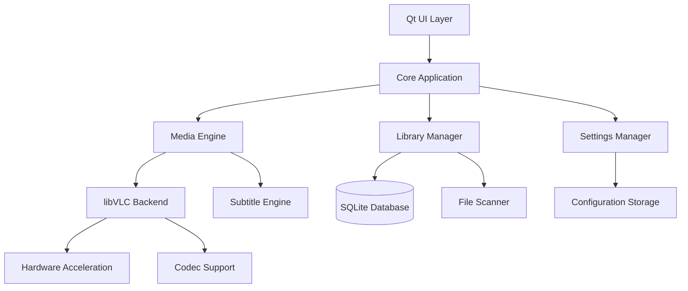

# EonPlay Design Document

## Overview

EonPlay - the timeless, futuristic media player - will be built using Qt 6 with C++ for optimal native performance and cross-platform compatibility. EonPlay uses libVLC as the primary playback engine for comprehensive codec support and hardware acceleration capabilities. The architecture follows a modular design with clear separation between UI, media processing, and system integration components, delivering a media experience that will "play for eons".

## Architecture

### High-Level Architecture



### Component Architecture

The application follows a layered architecture:

1. **Presentation Layer**: Qt 6 widgets providing native UI
2. **Application Layer**: Core business logic and coordination
3. **Media Layer**: libVLC integration and media processing
4. **Data Layer**: SQLite for metadata and configuration storage
5. **Platform Layer**: OS-specific integrations and installers

## Components and Interfaces

### 1. Core Application Component

**Responsibilities:**
- Application lifecycle management
- Component coordination
- Event handling and routing
- Cross-component communication

**Key Classes:**
- `EonPlayApplication`: Main application controller
- `EventBus`: Centralized event handling system
- `ComponentManager`: Manages component lifecycle

**Interfaces:**
```cpp
class IComponent {
public:
    virtual bool initialize() = 0;
    virtual void shutdown() = 0;
    virtual QString componentName() const = 0;
};

class IEventHandler {
public:
    virtual void handleEvent(const Event& event) = 0;
};
```

### 2. Media Engine Component

**Responsibilities:**
- Media file playback using libVLC
- Hardware acceleration management
- Playback state management
- Audio/video output control

**Key Classes:**
- `MediaEngine`: Main media playback controller
- `VLCBackend`: libVLC wrapper and integration
- `PlaybackController`: Playback state and controls
- `HardwareAcceleration`: GPU acceleration management

**Interfaces:**
```cpp
class IMediaEngine {
public:
    virtual bool loadMedia(const QString& path) = 0;
    virtual void play() = 0;
    virtual void pause() = 0;
    virtual void stop() = 0;
    virtual void seek(qint64 position) = 0;
    virtual void setVolume(int volume) = 0;
    virtual PlaybackState state() const = 0;
};

class IPlaybackEventListener {
public:
    virtual void onStateChanged(PlaybackState state) = 0;
    virtual void onPositionChanged(qint64 position) = 0;
    virtual void onDurationChanged(qint64 duration) = 0;
};
```

### 3. UI Component

**Responsibilities:**
- Native Qt widget-based interface
- User input handling
- Visual feedback and controls
- System integration (tray, media keys)

**Key Classes:**
- `MainWindow`: Primary application window
- `PlaybackControls`: Media control widgets
- `PlaylistWidget`: Playlist management UI
- `LibraryWidget`: Media library browser
- `SettingsDialog`: Application configuration UI
- `SystemTrayManager`: System tray integration

**Design Patterns:**
- Model-View architecture for playlist and library
- Command pattern for user actions
- Observer pattern for UI updates

### 4. Subtitle Engine Component

**Responsibilities:**
- Subtitle file parsing (SRT, ASS/SSA)
- Subtitle rendering and overlay
- Timing synchronization
- Style and positioning management

**Key Classes:**
- `SubtitleEngine`: Main subtitle controller
- `SRTParser`: SRT format parser
- `ASSParser`: ASS/SSA format parser
- `SubtitleRenderer`: Overlay rendering
- `SubtitleSynchronizer`: Timing management

### 5. Library Manager Component

**Responsibilities:**
- Media file scanning and indexing
- Metadata extraction and storage
- Playlist management
- Search and filtering capabilities

**Key Classes:**
- `LibraryManager`: Main library controller
- `MediaScanner`: File system scanning
- `MetadataExtractor`: Media file metadata extraction
- `PlaylistManager`: Playlist operations
- `DatabaseManager`: SQLite database operations

**Database Schema:**
```sql
-- Media files table
CREATE TABLE media_files (
    id INTEGER PRIMARY KEY,
    file_path TEXT UNIQUE NOT NULL,
    title TEXT,
    artist TEXT,
    album TEXT,
    duration INTEGER,
    file_size INTEGER,
    date_added DATETIME,
    last_played DATETIME,
    play_count INTEGER DEFAULT 0
);

-- Playlists table
CREATE TABLE playlists (
    id INTEGER PRIMARY KEY,
    name TEXT NOT NULL,
    created_date DATETIME,
    modified_date DATETIME
);

-- Playlist items table
CREATE TABLE playlist_items (
    id INTEGER PRIMARY KEY,
    playlist_id INTEGER,
    media_file_id INTEGER,
    position INTEGER,
    FOREIGN KEY (playlist_id) REFERENCES playlists(id),
    FOREIGN KEY (media_file_id) REFERENCES media_files(id)
);
```

### 6. Settings Manager Component

**Responsibilities:**
- Application configuration storage
- User preference management
- Platform-specific settings
- Configuration validation

**Key Classes:**
- `SettingsManager`: Configuration management
- `UserPreferences`: User-specific settings
- `PlatformSettings`: OS-specific configurations

## Data Models

### Media File Model
```cpp
class MediaFile {
private:
    QString m_filePath;
    QString m_title;
    QString m_artist;
    QString m_album;
    qint64 m_duration;
    qint64 m_fileSize;
    QDateTime m_dateAdded;
    QDateTime m_lastPlayed;
    int m_playCount;

public:
    // Getters and setters
    QString filePath() const { return m_filePath; }
    QString title() const { return m_title; }
    // ... other accessors
    
    // Validation
    bool isValid() const;
    bool fileExists() const;
};
```

### Playlist Model
```cpp
class Playlist {
private:
    int m_id;
    QString m_name;
    QList<MediaFile> m_items;
    QDateTime m_createdDate;
    QDateTime m_modifiedDate;

public:
    // Playlist operations
    void addItem(const MediaFile& file);
    void removeItem(int index);
    void moveItem(int from, int to);
    MediaFile currentItem() const;
    
    // Persistence
    bool save();
    bool load(int playlistId);
};
```

## Error Handling

### Error Categories
1. **Media Errors**: Codec issues, corrupted files, unsupported formats
2. **System Errors**: File access, hardware acceleration failures
3. **Network Errors**: Streaming failures, connection issues
4. **Configuration Errors**: Invalid settings, missing dependencies

### Error Handling Strategy
```cpp
class EonPlayError {
public:
    enum Type {
        MediaError,
        SystemError,
        NetworkError,
        ConfigurationError
    };
    
    enum Severity {
        Info,
        Warning,
        Error,
        Critical
    };
    
private:
    Type m_type;
    Severity m_severity;
    QString m_message;
    QString m_details;
    
public:
    // Error reporting and logging
    void report() const;
    QString userMessage() const;
    QString technicalDetails() const;
};
```

### Error Recovery Mechanisms
- Automatic fallback to software decoding when hardware acceleration fails
- Graceful degradation for unsupported subtitle formats
- Retry mechanisms for temporary file access issues
- User notification with actionable recovery options

## Testing Strategy

### Unit Testing
- **Framework**: Qt Test framework
- **Coverage**: Core business logic, data models, utility functions
- **Mock Objects**: Media engine interfaces, file system operations
- **Test Categories**:
  - Media file validation and metadata extraction
  - Playlist operations and persistence
  - Settings management and validation
  - Subtitle parsing and timing calculations

### Integration Testing
- **libVLC Integration**: Verify media playback functionality
- **Database Operations**: Test SQLite operations and migrations
- **File System Integration**: Test media scanning and file monitoring
- **Platform Integration**: System tray, media keys, file associations

### Performance Testing
- **Playback Performance**: CPU/memory usage during various media formats
- **Library Scanning**: Performance with large media collections
- **Startup Time**: Application initialization benchmarks
- **Memory Leaks**: Long-running playback sessions

### Platform Testing
- **Windows Testing**: Windows 10/11, different hardware configurations
- **Linux Testing**: Ubuntu, Fedora, Arch Linux distributions
- **Hardware Acceleration**: Various GPU vendors and drivers
- **Installation Testing**: Installer packages on clean systems

## Platform-Specific Considerations

### Windows Implementation
- **UI Framework**: Qt 6 with Windows-native styling
- **Media Keys**: Windows Media Foundation integration
- **File Associations**: Registry entries for supported formats
- **Hardware Acceleration**: DirectX Video Acceleration (DXVA)
- **Packaging**: WiX Toolset for MSI, NSIS for executable installer
- **Code Signing**: Authenticode signing with EV certificate

### Linux Implementation
- **UI Framework**: Qt 6 with system theme integration
- **Media Keys**: MPRIS D-Bus interface
- **File Associations**: XDG MIME type registration
- **Hardware Acceleration**: VA-API and VDPAU support
- **Packaging**: AppImage, .deb (dpkg), .rpm (rpmbuild)
- **Distribution**: GPG signing for package integrity

### Cross-Platform Abstractions
```cpp
class IPlatformIntegration {
public:
    virtual void registerFileAssociations() = 0;
    virtual void setupMediaKeys() = 0;
    virtual void configureHardwareAcceleration() = 0;
    virtual void setupSystemTray() = 0;
    virtual QString getConfigurationPath() = 0;
};

class WindowsPlatform : public IPlatformIntegration {
    // Windows-specific implementations
};

class LinuxPlatform : public IPlatformIntegration {
    // Linux-specific implementations
};
```

## Security Considerations

### Input Validation
- Media file header validation to prevent malicious file exploitation
- Subtitle file content sanitization
- URL validation for streaming sources
- File path validation to prevent directory traversal

### Process Isolation
- libVLC runs in separate process context where possible
- Subtitle rendering isolated from main application
- File scanning operations with limited permissions
- Network operations with timeout and size limits

### Update Security
- Code signing verification for application updates
- HTTPS-only update channels with certificate pinning
- Incremental update validation and rollback capability
- User consent for automatic updates

### Privacy Protection
- No telemetry collection without explicit user consent
- Local-only media library storage
- Secure deletion of temporary files
- Optional anonymous usage statistics with clear opt-out

## Performance Optimization

### Memory Management
- Efficient media buffer management with libVLC
- Lazy loading of media metadata
- Thumbnail caching with size limits
- Automatic cleanup of unused resources

### CPU Optimization
- Hardware-accelerated decoding prioritization
- Multi-threaded media scanning
- Efficient subtitle rendering algorithms
- Background processing for non-critical operations

### Storage Optimization
- SQLite database optimization with proper indexing
- Compressed thumbnail storage
- Efficient playlist serialization
- Configurable cache size limits

This design provides a solid foundation for implementing EonPlay - a high-quality, timeless, futuristic media player that meets all the specified requirements while maintaining good performance, security, and user experience across Windows and Linux platforms. EonPlay is designed to "play for eons" with a forward-thinking architecture that can evolve with future technologies.